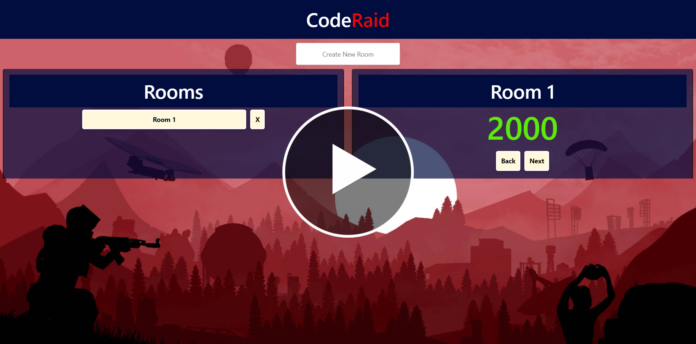

# Code Raid v1.0.0

A fast and convenient way to have access to the 10,000 most well-know 4-digit combinations used to break into any base in Facepunch Studio's popular multiplayer survival video game, Rust. 

## Description

Ever wanted to break into a base as quickly and efficiently as possible? Now you can! Simply grab some of your favorite friends and create a room with the name of your choice. If every user is connected to the same server, all of your friends should be able to see the room you created. Now all you guys have to do is enter in the code that is on screen to the base you're attempting to raid. Every 'Next' button click (no matter the user) should generate the next latest, most popular code. This prevents entering any duplicate codes and speeds up the raiding process. Have fun!

### Instructions

- In the text area, enter a name for the room to-be
- In the 'Rooms' box, select the room you just made or one that has already been created
- You should now see the latest code on-screen: try using it to break into the enemy base!
- If that didn't work, click 'Next' to go to the next most popular 4-digit combination that has not been seen yet
- If you'd 'like to see previous codes, simply click 'Back'

### Tech stack

- Front-end: React.js, Bootstrap, Node.js
- Back-end: ASP.NET C# (REST API), SQL 

### How It Works

If set up correctly, the front-end (React website) and back-end  (API + database) should be running on two separate servers, respectively. The website calls the backend for any extraction, interaction, or storage of user data. 

- With the creation, deletion, and use of a room and its codes, the user (front-end: React) is constantly interacting with the API methods (back-end: C#, SQL)
- Creating a room calls the custom-made Room POST API method which stores the room in a database
- Deleting a room calls the custom-made Room DELETE API method which deletes the room from the database
- Clicking on the room uses the Code GET API method that extracts info about the room and its codes and displays this information on-screen
- Clicking 'Next' calls the Code POST API method to create the next most popular code and displays it on-screen
- Clicking 'Back' calls the Code GET API method to extract the previous code and displays it on-screen

### Demo (YouTube Link)

